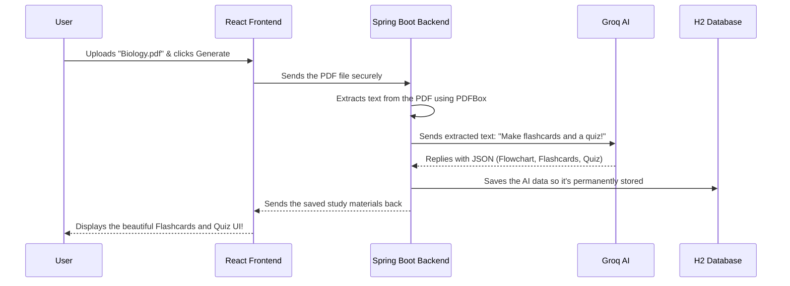

# AI Study Assistant - Project Documentation

Welcome to the **AI Study Assistant**! This document explains exactly how this project works, what technologies are used, and how all the pieces fit together. It is written in a beginner-friendly way.

---

## 🏗️ The Big Picture

The AI Study Assistant is a full-stack web application designed to help students study faster and more effectively. 

**What it does:**
1. A user uploads their lecture notes, a PDF, or a PowerPoint (`.pptx`) file.
2. The app reads the file and sends the text to Groq's Artificial Intelligence (Groq API).
3. The AI reads the text and automatically creates:
   - A detailed **Topic Flowchart** (to see how concepts connect).
   - **10 interactive Flashcards** (for memorization).
   - A **30-question Quiz** (to test knowledge).
4. The user takes the quiz, and the app records their score so they can track their progress over time on a Dashboard.

---

## 🧩 The Technologies Used (The "Tech Stack")

This project is built using modern, industry-standard tools. We can divide the project into two main halves: The **Frontend** and the **Backend**.

### 1. The Frontend (The Face of the App)
This is the part of the app you actually see and interact with in your web browser. 

* **React (JavaScript):** React is the framework used to build the user interface. Instead of loading new web pages every time you click a button, React allows the page to update instantly (like flipping a flashcard).
* **Tailwind CSS:** This handles all the styling. It gives us the beautiful dark mode, the glass-like cards, the blue/purple gradients, and the smooth hover animations.
* **React Router:** Allows the user to navigate between different pages smoothly (like going from the Dashboard to the Upload page).
* **Chart.js:** Used to draw the beautiful progress graphs on the Dashboard so students can see their test scores improving.

### 2. The Backend (The Engine Room)
This is the hidden part of the app that does all the heavy lifting, security, and logic.

* **Java & Spring Boot:** The backend is written in Java using the Spring Boot framework. Think of this as the manager of a restaurant. It receives requests from the frontend, decides what to do, talks to the database, and sends answers back.
* **Spring Security & JWT:** Handles user logins safely. When a user logs in, they get a secure digital "key card" (a JWT token) that keeps them logged in.
* **Apache PDFBox & Apache POI:** These are special tools the backend uses to open PDF and PowerPoint files and extract the raw text out of them.

### 3. The Database (The Filing Cabinet)
* **H2 Database:** This is where we save users, passwords, flashcards, and quiz scores. H2 is an "in-memory" database, meaning it is super lightweight and saves the data directly to a folder in your project (`backend/data`). It requires zero complicated setup.

### 4. The AI (The Brain)
* **Groq API:** Once the backend extracts text from a file, it sends that text over the internet to Groq's AI servers using your secret API Key. The AI acts as a super-tutor, reading the text and generating the study materials.

---

## 🔄 How It Works: Step-by-Step

Here is exactly what happens when you click "Generate Study Materials":

1. **Upload:** You drag and drop a file on the Frontend.
2. **Transit:** The Frontend sends that file to the Backend.
3. **Reading:** The Backend cracks open the file and pulls out the words.
4. **AI Generation:** The Backend sends the words to Groq AI and says: *"Follow these strict rules: Give me a flowchart, exactly 10 flashcards, and exactly 30 quiz questions."*
5. **Saving:** Groq AI replies with the homework. The Backend saves this into the H2 Database.
6. **Display:** The Backend hands the data back to the Frontend, which renders the nice-looking flashcards on your screen.

---

## 🎨 Where to Find Things in the Code

If you ever want to change how the app works or looks, here is your cheat sheet:

* **Want to change colors, buttons, or layouts?**
  Look in the Frontend folder. `frontend/tailwind.config.js` controls the main colors, `frontend/src/styles/index.css` has custom CSS, and the actual screens are in `frontend/src/pages/`.
  
* **Want to change how the AI responds or how many flashcards it makes?**
  Look in the Backend folder. specifically `backend/src/main/java/com/studyassistant/service/GroqService.java`.

* **Want to change the database or the Google API Key?**
  Look at `backend/src/main/resources/application.properties`. This file holds all your secret keys and configurations.

Enjoy building and expanding your AI Study Assistant!
