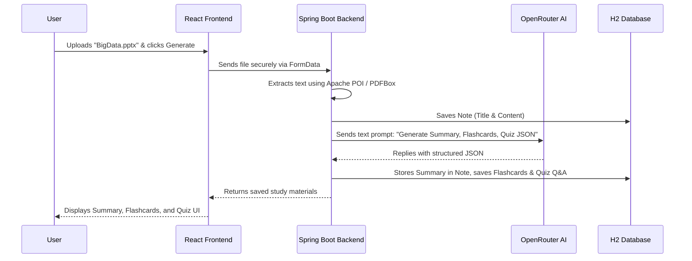

# AI Study Assistant - Project Documentation

Welcome to the **AI Study Assistant**! This document explains exactly how this project works, what technologies are used, and how all the pieces fit together. It is written in a beginner-friendly way.

---

## 🏗️ The Big Picture

The AI Study Assistant is a full-stack web application designed to help students study faster and more effectively. 

**What it does:**
1. A user uploads their lecture notes, a PDF, or a PowerPoint (`.pptx`) file (or pastes text notes directly).
2. The app extracts the text and sends it to the OpenRouter AI API.
3. The AI reads the text and automatically creates:
   - A clear, concise **Topic Summary** (covering key concepts and takeaways).
   - Interactive **Flashcards** (for active recall & memorization).
   - A **Multiple-Choice Quiz** (to test understanding).
4. All generated materials (Summary, Flashcards, Quiz Q&A) are saved in the database under **Notes History** so students can revisit them anytime without regenerating.
5. The user takes quizzes, and the app tracks their score and percentage on an interactive **Dashboard** and **Progress** page.

---

## 🧩 The Technologies Used (The "Tech Stack")

This project is built using modern, industry-standard tools. We can divide the project into two main halves: The **Frontend** and the **Backend**.

### 1. The Frontend (The Face of the App)
This is the part of the app you actually see and interact with in your web browser. 

* **React (JavaScript):** React is the framework used to build the user interface. Instead of loading new web pages every time you click a button, React allows the page to update instantly (like flipping a flashcard or switching tabs).
* **Tailwind CSS:** Handles all the styling. It provides the modern Liquid Glass / Deep Aurora theme, glowing cards, glassmorphic glass cards, and smooth hover animations.
* **React Router:** Allows the user to navigate between different pages smoothly (Dashboard, Upload Notes, Notes History, Progress, Study, Quiz).
* **Chart.js:** Used to render interactive progress graphs on the Dashboard and Progress page so students can visualize their score history over time.

### 2. The Backend (The Engine Room)
This is the hidden part of the app that handles business logic, security, document processing, and AI integrations.

* **Java & Spring Boot 3:** The backend is written in Java using Spring Boot. It receives requests from the frontend, manages business logic, communicates with the database, and interfaces with AI services.
* **Spring Security & JWT:** Handles secure user authentication. Upon login, a JSON Web Token (JWT) is issued to cryptographically authenticate all subsequent API requests.
* **Apache PDFBox & Apache POI:** Tools used by the backend to open PDF and PowerPoint (`.pptx`) files and extract raw text from them.

### 3. The Database (The Filing Cabinet)
* **H2 Database:** An embedded SQL database that saves users, notes, AI-generated summaries, flashcards, quizzes, questions, and attempt history into a local file directory (`backend/data`). It requires zero setup and is easy to deploy.

### 4. The AI Integration (The Brain)
* **OpenRouter API:** The backend sends extracted note text to OpenRouter's AI API using a secret key. OpenRouter acts as an aggregator router, allowing the application to utilize free-tier LLMs (like Llama / Mistral models) to output structured JSON containing the summary, flashcards, and quiz questions.

---

## 🔄 How It Works: Step-by-Step

Here is exactly what happens when you click "Upload & Generate Study Materials":

1. **Upload / Input:** You paste text or drag-and-drop a PDF/PPTX file on the **Upload Notes** page.
2. **Text Extraction:** The Backend extracts the raw text from the document.
3. **AI Generation:** The Backend formats a structured prompt and sends it to OpenRouter AI.
4. **Data Persistence:** The AI returns JSON containing the Summary, Flashcards, and Quiz Questions. The Backend saves the Summary to the `Note` entity, inserts the `Flashcard` records, and creates the `Quiz` & `QuizQuestion` records in H2.
5. **Notes History & Learning:** The student can view the generated study materials immediately, retake the quiz anytime, or view past notes on the **Notes History** page without needing to call the AI again.

---

## 🎨 Where to Find Things in the Code

* **Frontend UI Pages:** `frontend/src/pages/`
  - `DashboardPage.jsx`: Stats summary & Chart.js score history graph.
  - `NotesPage.jsx`: Page to upload PDFs/PPTXs or paste text notes.
  - `HistoryPage.jsx`: Interactive history page showing past notes, stored summaries, flashcards, and quiz Q&A.
  - `StudyPage.jsx`: View newly generated AI study materials.
  - `QuizPage.jsx` & `ResultPage.jsx`: Interactive quiz interface & score calculation.
  - `ProgressPage.jsx`: Detailed quiz performance history and pagination.

* **Backend Services & Controllers:** `backend/src/main/java/com/studyassistant/`
  - `service/OpenRouterService.java`: AI prompt engineering, API call, JSON parsing, and saving materials.
  - `service/NoteService.java`: File parsing (PDF/PPTX) and retrieving stored materials for Notes History.
  - `controller/NoteController.java`: API endpoints for creating, retrieving, and fetching notes history.

* **Configuration & Environment Variables:**
  - `backend/src/main/resources/application.properties`: Local configuration and fallback values.
  - `backend/src/main/resources/application-prod.yml`: Production configuration for Render deployment (`OPENROUTER_API_KEY`, `ALLOWED_ORIGIN`).
